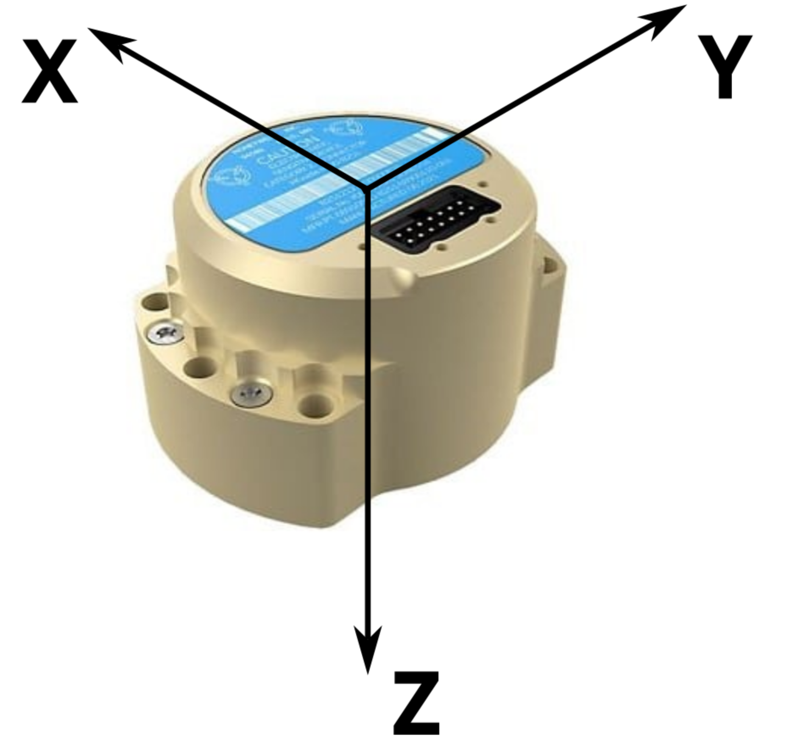

[](https://opensource.org/licenses/MIT)

 &nbsp; &nbsp; 

# Hg4930
This library communicates with [Honeywell HG4930 IMU](https://aerospace.honeywell.com/us/en/products-and-services/product/hardware-and-systems/sensors/hg4930-mems-inertial-measurement-unit) over RS422. This library is compatible with Arduino and CMake build systems.
   * [License](LICENSE.md)
   * [Changelog](CHANGELOG.md)
   * [Contributing guide](CONTRIBUTING.md)

# Description
The HG4930 is a very high performance MEMS IMU. The accelerometer range is +/- 20 g's and gyro range is +/- 400 deg/s. In addition to 3-axis acceleration and gyro data, the HG4930 also sums and outputs the incremental angle and incremental velocity, enabling estimation of the IMU attitude at a reduced host computer workload.

IMU data is available at 600 Hz and the incremental angle / incremental velocity data is available at 100 Hz. RS422 is used to transmit data from the IMU to the microcontroller at a baudrate of 1 Mbps.

# Installation

## Arduino
Use the Arduino Library Manager to install this library or clone to your Arduino/libraries folder. This library is added as:

```C++
#include "hg4930.h"
```

Example Arduino executables are located in: *examples/arduino/*. Teensy 3.x, 4.x, and LC devices are used for testing under Arduino and this library should be compatible with other Arduino devices.

## CMake
CMake is used to build this library, which is exported as a library target called *hg4930*. This library is added as:

```C++
#include "hg4930.h"
```

The library can be also be compiled stand-alone using the CMake idiom of creating a *build* directory and then, from within that directory issuing:

```
cmake .. -DMCU=MK66FX1M0
make
```

This will build the library and an example executable called *hg4930_example*. The example executable source files are located at *examples/cmake*. Notice that the *cmake* command includes a define specifying the microcontroller the code is being compiled for. This is required to correctly configure the code, CPU frequency, and compile/linker options. The available MCUs are:
   * MK20DX128
   * MK20DX256
   * MK64FX512
   * MK66FX1M0
   * MKL26Z64
   * IMXRT1062_T40
   * IMXRT1062_T41
   * IMXRT1062_MMOD

These are known to work with the same packages used in Teensy products. Also switching packages is known to work well, as long as it's only a package change.

The example target also has a *_hex*, for creating the hex file to upload to the microcontroller, and an *_upload* for using the [Teensy CLI Uploader](https://www.pjrc.com/teensy/loader_cli.html) to flash the Teensy. Please note that instructions for setting up your build environment can be found in our [build-tools repo](https://github.com/bolderflight/build-tools).

# Namespace
This library is within the namespace *bfs*.

# Orientation
Data is returned in the following orientation. Angular and angular rate data are returned as right-hand rotations about each axis. Please note that this is different that the orientation displayed in the [Honeywell HGuide Data Reader Software](https://aerospace.honeywell.com/us/en/products-and-services/product/hardware-and-systems/sensors/honeywell-hguide-data-reader-software), our orientation was rotated to ease integration for aeronautics applications.



# Hg430

## Methods

**Hg4930()** Creates an *Hg4930* object with the default constructor. Requires calling the *Config* method before *Begin*.

**Hg4930(HardwareSerial &ast;bus)** Creates an *Hg4930* object given a pointer to the Hardware Serial object. Note that RS422 transceivers may have transmitter enable and receiver enable pins. These should be configured outside of this library to enable receiving data; there is no transmission of data necessary.

```C++
/* HG4930 object on Serial1 */
bfs::Hg4930 imu(&Serial1);
```

**void Config(HardwareSerial &ast;bus)** Configures the Hardware Serial object; required if the default constructor is used.

**void Begin()** Initializes the communication bus to receive data from the HG4930 sensor.

```C++
/* Initialize IMU */
imu.Begin();
```

**bool Read()** Checks for new messages from the HG9430 sensor and returns true if a new message has been received.

```C++
/* Read data */
if (imu.Read()) {
  Serial.print(imu.accel_x_mps2());
  Serial.print("\t");
  Serial.print(imu.accel_y_mps2());
  Serial.print("\t");
  Serial.print(imu.accel_z_mps2());
  Serial.print("\t");
  Serial.print(imu.gyro_x_radps());
  Serial.print("\t");
  Serial.print(imu.gyro_y_radps());
  Serial.print("\t");
  Serial.print(imu.gyro_z_radps());
  Serial.print("\t");
  Serial.print(imu.delta_angle_x_rad());
  Serial.print("\t");
  Serial.print(imu.delta_angle_y_rad());
  Serial.print("\t");
  Serial.print(imu.delta_angle_z_rad());
  Serial.print("\t");
  Serial.print(imu.delta_vel_x_mps());
  Serial.print("\t");
  Serial.print(imu.delta_vel_y_mps());
  Serial.print("\t");
  Serial.print(imu.delta_vel_z_mps());
  Serial.print("\t");
  Serial.print(imu.die_temp_c());
  Serial.print("\n");
}
```

**bool new_imu_data()** Returns true if new IMU data (i.e. accel, gyro, and die temperature) has been received.

**new_ins_data()** Returns true if new INS data (i.e. delta angle and delta velocity) hass been received.

### Health and Status

Note that the HG4930 sensor returns many health and status flags. The following methods return the status of these flags. Please refer to the included manual in the docs folder *Status Word 1* and *Status Word 2* tables for a detailed description of each.

   * bool imu_healthy()
   * bool gyro_healthy()
   * bool accel_healthy()
   * bool gyro_ok()
   * bool gyro_x_valid()
   * bool gyro_y_valid()
   * bool gyro_z_valid()
   * bool imu_ok()
   * bool gyro_health_1()
   * bool start_data_flag()
   * bool process_test()
   * bool memory_test()
   * bool electronics_test()
   * bool gyro_health_2()
   * bool accel_health()

### Data

**Accelerometer** accel data from the last successful read can be retrieved from the *Hg4930* object with the *float accel_x_mps2()*, *float accel_y_mps2()*, and *float accel_z_mps2()* methods. Data is returned in units of m/s/s.

**Gyro** gyro data from the last successful read can be retrieved from the *Hg4930* object with the *float gyro_x_radps()*, *float gyro_y_radps()*, and *float gyro_z_radps()* methods. Data is returned in units of rad/s.

**Delta Angle** delta angle data from the last successful read can be retrieved from the *Hg4930* object with the *double delta_angle_x_rad()*, *double delta_angle_y_rad()*, and *double delta_angle_z_rad()* methods. Data is returned in units of rad.

**Delta Velocity** delta velocity data from the last successful read can be retrieved from the *Hg4930* object with the *delta_vel_x_mps())*, *delta_vel_y_mps()*, and *delta_vel_z_mps()* methods. Data is returned in units of m/s.

**Die Temperature** the sensor die temperature can be retrieved with the *float die_temp_c()* method.
